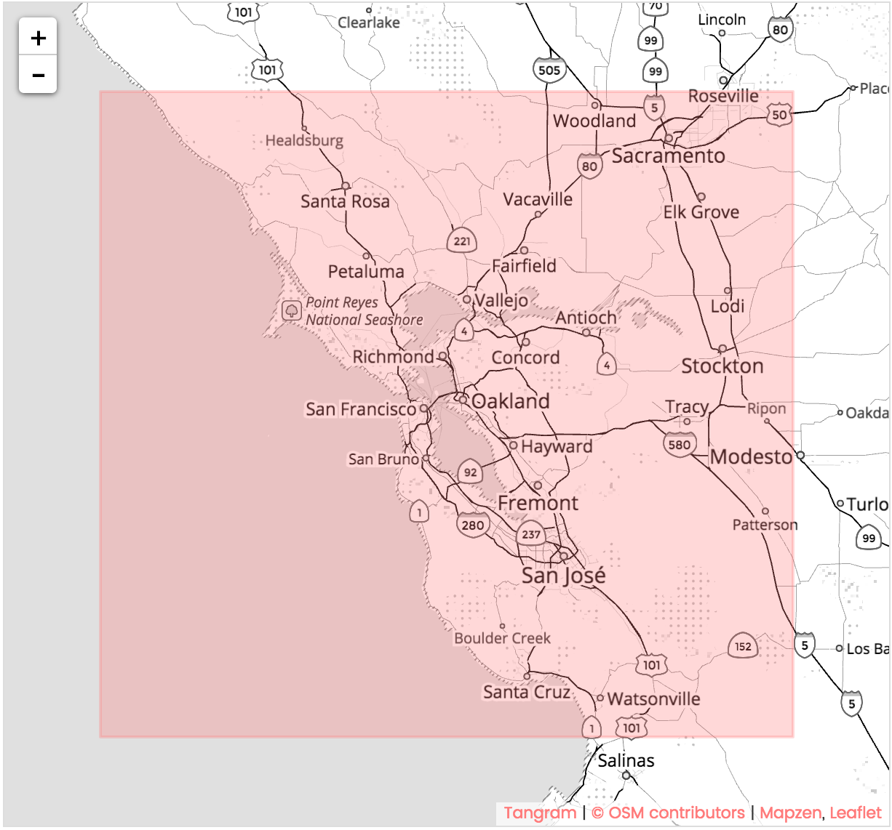

# OpenStreetMap Data Case Study

### Author: Jianru Shi 
### Last edit: April 2017
### Map area: San Francisco Bay Area

## Introduction 

This report is one of projects for the Data Analyst Nano Degree at Udacity. 

In this project, I choose the San Francisco Bay Area in [OpenStreetMap](https://www.openstreetmap.org) and use data munging techniques to assess the quality of the data for validity, accuracy, completeness, consistency and uniformity. I will also show my approach to clean the OpenStreetMap data programmatically. At the end I will conduct some SQL quries to give some overviews about the SF Bay Area. 



The outline of the this report is: 

* Introduction
* Data Sampling
* Data Auditing 
* Data Cleanning 
* Create Database and Tables
* Data Exploring with SQL
* Additional Ideas


```python
# Useful packages
import xml.etree.cElementTree as ET
import csv
import re
from collections import defaultdict
import codecs
import cerberus
import schema
import sqlite3 
import pandas as pd
```

## Data Sampling

The data is downloaded from [OpenStreetMap](https://www.openstreetmap.org). The full dataset is 3.03GB. I first use [sample_data](funcs/sample_func.py) function to take subsets of the data. I use a small subset (about 3MB) to test my code and then use an intermedian subset of data (about 300MB) to do the data auditing. The sampling process takes about **10 minutes** since the original file is large. The function returns two new osm files: [sample.osm](funcs/sample.osm) and [test.osm](funcs/test.osm).  


```python
# take samples from original osm file

OSM_FILE = "SFBay.osm" 
SAMPLE_FILE = "sample.osm" # small subset about  3M
TEST_FILE="test.osm" #intermediate subset about 300M 


def get_element(osm_file, tags=('node', 'way', 'relation')):
    """Yield element if it is the right type of tag

    Reference:
    http://stackoverflow.com/questions/3095434/inserting-newlines-in-xml-file-generated-via-xml-etree-elementtree-in-python
    """
    context = iter(ET.iterparse(osm_file, events=('start', 'end')))
    _, root = next(context)
    for event, elem in context:
        if event == 'end' and elem.tag in tags:
            yield elem
            root.clear()         
            
## define function that take small and median size samples from full data file
def sample_data (full, small, median): 
    
    k = 1000 # Parameter: take every k-th top level element, take small sample
    m = 10 # take intermediate sample  
    with open(small, 'w') as output1, open(median,'w') as output2:
        output1.write('<?xml version="1.0" encoding="UTF-8"?>\n')
        output1.write('<osm>\n  ')
        output2.write('<?xml version="1.0" encoding="UTF-8"?>\n')
        output2.write('<osm>\n  ')
    # Write every kth top level element
        for i, element in enumerate(get_element(full)):
            if i % k == 0:
                output1.write(str(ET.tostring(element, encoding='utf-8')))
                output2.write(str(ET.tostring(element, encoding='utf-8')))
            elif i % m == 0:
                output2.write(str(ET.tostring(element, encoding='utf-8')))
        output1.write('</osm>')
        output2.write('</osm>')
        
sample_data(OSM_FILE, SAMPLE_FILE,TEST_FILE)
```

## Data Auditing

To audit the data I use the function [audit_address](funcs/audit_func.py) to check if there is any problem with data associated with the address, for example the street name, city and county name, and the postcode.

By running the test data in auditing functions I found following problems: 

* Inconsistency of street types (Street vs. ST, Avenue vs. AVE)


* Typoes and invailid street types ('Avenies', '88', 'CA-88')


* Invalid postcode (6digits postcode, postcodes are not in CA)


* Using full address as postcode (41 Westside Blvd, Hollister, CA 95023)


* Inconsistency of city names ('Vallejo' vs. ''Vallejo, California', 'Oakland' vs. 'oakland')


* Inconsistency of county names ('Santa Clara County' vs. 'Santa Clara')


* Inconsistency of state names ('CA', 'Ca' vs. 'California')


* Incorrect state names ('WA', 'AZ')


```python
# audit_address function audits the data from the open street map and try to find problems associated with addresses
# the argument 'content' can take 'postcode', 'street','state', 'city' or 'county'.
def audit_address(filename, content):
        key='addr:'+ content
        expected = ["Street", "Avenue", "Boulevard", "Drive", "Court", "Place", "Square", "Lane", "Road", 
            "Trail", "Parkway", "Commons","Way", "Circle", "Key","Terrace", "Garden"]
    
# When the content is 'postcode', the function audits the validity of the postcode
# For CA, the postcode starts with 94 or 95. 
# To make the data consistent, I use 5 digitals postcode format

        if content=='postcode':
            i=0   #set a records tracker 
            for event, elem in ET.iterparse(filename, events=("start",)):
                i+=1
                if elem.tag == "node" or elem.tag == "way":
                    for tag in elem.iter("tag"):
                        if tag.attrib['k']== key:
                            if (tag.attrib['v'][0:2]!='94' and tag.attrib['v'][0:2]!='95') or (len(tag.attrib['v'])!=5): 
                                print(i)
                                print (tag.attrib['v'])

# When the content is 'street', the function audits the validity of the street name
# It returns a dictionary with street types as keys and corresponding counts as values. 

        elif content=='street':
            
            street_types = {}
            street_type_re = re.compile(r'\b\S+\.?$', re.IGNORECASE)
            for event, elem in ET.iterparse(filename, events=("start",)):
                if elem.tag == "node" or elem.tag == "way":
                    for tag in elem.iter("tag"):
                        if tag.attrib['k']== key:
                            m = street_type_re.search(tag.attrib['v'])
                            if m:
                                street_type = m.group() #group(): Return the string matched by the RE
                                if street_type not in expected:
                                    street_types[street_type]=street_types.get(street_type,0)+1
            print (street_types)
                                
                            
                    
                                
# When the content is state, city, or county, the function audits the validity of data
# by returning a dictionary which give information of the values and counts of corresponding content
        
        else:
            values_dict={}
            key='addr:'+ content
            for event, elem in ET.iterparse(filename, events=("start",)):
                if elem.tag == "node" or elem.tag == "way":
                    for tag in elem.iter("tag"):
                        if tag.attrib['k']== key:
                            values_dict[tag.attrib['v']]=values_dict.get(tag.attrib['v'],0)+1
            print(values_dict)
            

```


```python
# audit street types
audit_address(TEST_FILE, 'street')
```


```python
# audit postcode
audit_address(TEST_FILE, 'postcode')
```


```python
# audit city names
audit_address(TEST_FILE, 'city')
```


```python
# audit county names
audit_address(TEST_FILE, 'county')
```


```python
# audit state names
audit_address(TEST_FILE, 'state')
```

## Data Cleanning 

After auditing the test data file, I found some problems as stated above. In this sections I use the [process_map](funcs/process_func.py) to clean problematical data. The main function process_map converts the processed .osm file to 5 .csv files and will be used to build the SQL database for further analysis. The csv files are: 


* nodes.csv
* nodes_tags.csv
* ways.csv
* ways_nodes.csv
* ways_tags.csv

With calling some [helper functions](funcs/helper_func.py) in the main function, the address information in the dataset will be revised by:


* clean postcode: remove prefix 'CA' from some data or extract the 5 digits postcode from the full address
* clean street: change abbrivated street type to full street suffix 
* clean state: change abbrivated state names to "CA"


```python
street_type_re = re.compile(r'\b\S+\.?$', re.IGNORECASE)
expected = ["Street", "Avenue", "Boulevard", "Drive", "Court", "Place", "Square", "Lane", "Road", 
            "Trail", "Parkway", "Commons","Way", "Circle", "Key","Terrace", "Garden"]

# UPDATE THIS VARIABLE
mapping = { "St": "Street",
            "St.": "Street",
            "Ave": "Avenue",
            "Ave.":"Avenue",
            "Rd.": "Road",
            "BLVD": "Boulevard",
            "Dr.": "Drive",
            "PL": "Place",
            "Pl": "Place",
            "Ln":"Lane",
            "Ct": "Court",
            "Blvd": "Boulevard",
            "Cir": "Circle",
            "Dr": "Drive"
           
            }

NODES_PATH = "nodes.csv"
NODE_TAGS_PATH = "nodes_tags.csv"
WAYS_PATH = "ways.csv"
WAY_NODES_PATH = "ways_nodes.csv"
WAY_TAGS_PATH = "ways_tags.csv"

LOWER_COLON = re.compile(r'^([a-z]|_)+:([a-z]|_)+')
PROBLEMCHARS = re.compile(r'[=\+/&<>;\'"\?%#$@\,\. \t\r\n]')

SCHEMA = schema.schema

# Make sure the fields order in the csvs matches the column order in the sql table schema
NODE_FIELDS = ['id', 'lat', 'lon', 'user', 'uid', 'version', 'changeset', 'timestamp']
NODE_TAGS_FIELDS = ['id', 'key', 'value', 'type']
WAY_FIELDS = ['id', 'user', 'uid', 'version', 'changeset', 'timestamp']
WAY_TAGS_FIELDS = ['id', 'key', 'value', 'type']
WAY_NODES_FIELDS = ['id', 'node_id', 'position']


# ================================================== #
#               Helper Functions                     #
# ================================================== #
def get_element(osm_file, tags=('node', 'way', 'relation')):
    """Yield element if it is the right type of tag"""
    context = ET.iterparse(osm_file, events=('start', 'end'))
    _, root = next(context)
    for event, elem in context:
        if event == 'end' and elem.tag in tags:
            yield elem
            root.clear()


class UnicodeDictWriter(csv.DictWriter, object):
    """Extend csv.DictWriter to handle Unicode input"""

    def writerow(self, row):
        super(UnicodeDictWriter, self).writerow({
            k : v for k, v in row.items()
        })

    def writerows(self, rows):
        for row in rows:
            self.writerow(row)


def update_name(name, mapping):
    street=street_type_re.search(name).group()

    name=name.replace(street, mapping[street])

    return name

```


```python
#clean_element function take tag['value'] and tag['key'] as input and return the updated tag values 
def clean_element(tag_value, tag_key):
    
    ## clean postcode 
    if tag_key=='postcode':
        if (tag_value[0:2]!='94' and tag_value[0:2]!='95') or (len(tag_value)!=5):
            ## find postcode start with 'CA' and remove the 'CA' 
            if tag_value[0:2]=='CA': 
                    tag_value=tag_value[-5:]
     
                    #print (tag_value)
                            
            ##  find cases that using full address as postcode and extract the postcode using re module
            else:
                if len(tag_value)>10:
                    #print(tag.attrib['v'])
                    pc=re.search('\d{5}', tag_value)
                    if pc:
                        tag_value=pc.group()
              
    ## clean state name, use uniformat 'CA'       
    elif tag_key=='state':
        if tag_value=='Ca' or tag_value=='ca' or tag_value=='California':
            tag_value='CA'
        
    ## clean street suffix, change abbrivations to full street suffix        
    elif tag_key=='street':
        street_type_re = re.compile(r'\b\S+\.?$', re.IGNORECASE)
        full_addr=tag_value
        m = street_type_re.search(full_addr)
        if m:
            street_type = m.group() #group(): Return the string matched by the RE
            if street_type not in expected:
                if street_type in mapping:
                    tag_value=update_name(full_addr, mapping) # call update_name function 
    ## return updated tag_value
    return tag_value
                             

```


```python

## Clean and shape node or way XML element to Python dict

def shape_element(element, node_attr_fields=NODE_FIELDS, way_attr_fields=WAY_FIELDS,
                  problem_chars=PROBLEMCHARS, default_tag_type='regular'):
   
    node_attribs = {}
    way_attribs = {}
    way_nodes = []
    tags = []  # Handle secondary tags the same way for both node and way elements
   
    ## clean node element
    if element.tag=='node':
        for primary in element.iter():
            for i in node_attr_fields: 
                if i in primary.attrib: 
                    node_attribs[i]=primary.attrib[i]
        if len(element)!=0:
            for j in range(0, len(element)): 
                childelem=element[j]
                tag={}
                if not problem_chars.search(childelem.attrib['k']): ## ignor problematic element
                    tag["id"]=element.attrib["id"]
                    tag["type"]=default_tag_type
                    tag['value']=childelem.attrib['v']
                    if ":" in childelem.attrib['k']:
                        k_and_v=childelem.attrib['k'].split(':',1)
                        tag["type"]=k_and_v[0]
                        tag["key"]=k_and_v[1]
                        if tag["type"]=='addr':
                            tag["value"]=clean_element(tag["value"],tag["key"]) ## call clean_element function
                    else:
                        tag["key"]=childelem.attrib['k']
                        if tag["type"]=='addr':
                            print(tag_value, tag["key"])
                            tag["value"]=clean_element(tag["value"],tag["key"])
                tags.append(tag)
                
        return ({'node': node_attribs, 'node_tags': tags})            
                    
    ## handle way element               
    elif element.tag=='way':
        for primary in element.iter():
            for i in way_attr_fields: 
                if i in primary.attrib: 
                    way_attribs[i]=primary.attrib[i]   
        
        if len(element)!=0: 
            for j in range(0, len(element)): 
                childelem=element[j]
                tag={}
                if childelem.tag=='tag':
                    if not problem_chars.search(childelem.attrib['k']):
                        tag["id"]=element.attrib["id"]
                        tag["type"]=default_tag_type
                        tag["value"]=childelem.attrib['v']
                        if ":" in childelem.attrib['k']:
                            k_and_v=childelem.attrib['k'].split(':',1)
                            tag["key"]=k_and_v[1]
                            tag["type"]=k_and_v[0]
                            if tag["type"]=='addr':
                                tag["value"]=clean_element(tag["value"],tag["key"]) #call clean_element function
                        else:
                            tag["key"]=childelem.attrib['k']
                            if tag["type"]=='addr':
                                tag["value"]=clean_element(tag["value"],tag["key"]) #update tag values
                    tags.append(tag)
                    
                elif childelem.tag=='nd':
                    #print (childelem.attrib['ref'])
                    way_node={}
                    way_node['id']=element.attrib['id'] 
                    way_node['node_id']=childelem.attrib['ref']
                    way_node['position']=j
                    #print(way_node)
                    way_nodes.append(way_node)
                    
        return ({'way': way_attribs, 'way_nodes': way_nodes, 'way_tags': tags})
```


```python

# ================================================== #
#               Main Function                        #
# ================================================== #

## process the file, clean and write XML into csv according to given schema

def process_map(file_in):
    """Iteratively process each XML element and write to csv(s)"""
    with codecs.open(NODES_PATH, 'w') as nodes_file, \
         codecs.open(NODE_TAGS_PATH, 'w') as nodes_tags_file, \
         codecs.open(WAYS_PATH, 'w') as ways_file, \
        codecs.open(WAY_NODES_PATH, 'w') as way_nodes_file, \
         codecs.open(WAY_TAGS_PATH, 'w') as way_tags_file:
                
        nodes_writer = UnicodeDictWriter(nodes_file, NODE_FIELDS)
        node_tags_writer = UnicodeDictWriter(nodes_tags_file, NODE_TAGS_FIELDS)
        ways_writer = UnicodeDictWriter(ways_file, WAY_FIELDS)
        way_nodes_writer = UnicodeDictWriter(way_nodes_file, WAY_NODES_FIELDS)
        way_tags_writer = UnicodeDictWriter(way_tags_file, WAY_TAGS_FIELDS)

        
        nodes_writer.writeheader()
        
        node_tags_writer.writeheader()
        ways_writer.writeheader()
        way_nodes_writer.writeheader()
        way_tags_writer.writeheader()
    
       
        for element in get_element(file_in, tags=('node', 'way')):
            el = shape_element(element)
            if el:

                if element.tag == 'node':
                    nodes_writer.writerow(el['node'])
                    node_tags_writer.writerows(el['node_tags'])
                elif element.tag == 'way':
                    ways_writer.writerow(el['way'])
                    way_nodes_writer.writerows(el['way_nodes'])
                    way_tags_writer.writerows(el['way_tags'])

```


```python
process_map(OSM_FILE)
```

## Create Database and Tables


In this section, I first created a database named 'sfbay.db', and import the five csv files into the database. I created tables using the to_sql function in pandas package. The full code is in [create_db.py](funcs/create_db.py)


```python
# create database sfbay.db and tables from csv files. 

conn=sqlite3.connect('sfbay.db')
cur = conn.cursor() 
cur.execute("CREATE TABLE nodes ( id INTEGER PRIMARY KEY NOT NULL, lat REAL, lon REAL,\
    user TEXT, uid INTEGER, version INTEGER, changeset INTEGER, timestamp TEXT )")
conn.commit()
node_df = pd.read_csv('nodes.csv', dtype=object)
node_df.to_sql('nodes', conn, if_exists='append', index=False)


cur.execute("CREATE TABLE nodes_tags (\
    id INTEGER,\
    key TEXT,\
    value TEXT,\
    type TEXT,\
    FOREIGN KEY (id) REFERENCES nodes(id)\
)")
conn.commit()
nodetag_df=pd.read_csv('nodes_tags.csv')
nodetag_df.to_sql('nodes_tags', conn, if_exists='append', index=False)

cur.execute("CREATE TABLE ways (\
    id INTEGER PRIMARY KEY NOT NULL,\
    user TEXT,\
    uid INTEGER,\
    version TEXT,\
    changeset INTEGER,\
    timestamp TEXT\
)")
conn.commit()
way_df=pd.read_csv('ways.csv')
way_df.to_sql('ways', conn, if_exists='append', index=False)

cur.execute("CREATE TABLE ways_nodes (\
    id INTEGER NOT NULL,\
    node_id INTEGER NOT NULL, \
    position INTEGER NOT NULL, \
    FOREIGN KEY (id) REFERENCES ways(id),\
    FOREIGN KEY (node_id) REFERENCES nodes(id)\
)")
conn.commit()
waynode_df=pd.read_csv('ways_nodes.csv')
waynode_df.to_sql('ways_nodes', conn, if_exists='append', index=False)


cur.execute("CREATE TABLE ways_tags (\
    id INTEGER NOT NULL,\
    key TEXT NOT NULL,\
    value TEXT NOT NULL,\
    type TEXT,\
    FOREIGN KEY (id) REFERENCES ways(id)\
)")
conn.commit()
waytag_df=pd.read_csv('ways_tags.csv')
waytag_df=waytag_df.dropna(subset=['id', 'key', 'value'], how='any')
waytag_df.to_sql('ways_tags', conn, if_exists='append', index=False)


```

## Data Exploration with SQL

### Database overview- files sizes


```python
# Database overview 
# list file sizes in the data folder.  
# ref http://stackoverflow.com/questions/10565435/iterating-through-directories-and-checking-the-files-size

import os
cwd = os.getcwd()
for root, dirs, files in os.walk(cwd+'/OSM_data', topdown=False):
    for name in files:
        f = os.path.join(root, name)
        print (name.ljust(20), round(os.path.getsize(f)/1000000, 2), 'MB')
```

    .DS_Store            0.01 MB
    nodes.csv            1182.59 MB
    nodes_tags.csv       27.62 MB
    sfbay.db             1625.4 MB
    SFBay.osm            3031.44 MB
    ways.csv             92.49 MB
    ways_nodes.csv       394.77 MB
    ways_tags.csv        174.52 MB


### Database overview - Numbers of nodes and ways

There are 14149895 nodes and 1557085 ways. 


```python
query='''select count(id) from nodes; '''

result=cur.execute(query)
for row in result:
    print (row)
```

    (14149895,)


```python
query='''select count(id) from ways; '''

result=cur.execute(query)
for row in result:
    print (row)
```

    (1557085,)


### Database overview - Top 10 contributors


```python
# Top 10 contributor and the number of nodes they craeted

query='select user, count(*) from nodes group by user order by count(*) desc limit 10;'
for row in cur.execute(query):
    print (row)
```

    ('nmixter', 1582191)
    ('andygol', 1167899)
    ('ediyes', 1019023)
    ('Eureka gold', 709818)
    ('Luis36995', 706698)
    ('woodpeck_fixbot', 636960)
    ('RichRico', 547427)
    ('dannykath', 532098)
    ('mk408', 403888)
    ('Rub21', 391532)


### Database overview - Count of distinct users 

There are 5480 distinct users.


```python
query='select count(distinct(user)) from \
(select user from nodes union all select user from ways);'

result=cur.execute(query)
for row in result:
    print (row)
```

    (5480,)


### Database overview - Count of shops

There are 9907 nodes tags have 'shop' as key. 


```python
query='''select count(*) from nodes_tags where key='shop';'''

result=cur.execute(query)
for row in result:
    print (row)
```

    (9907,)


### How many Starbucks store in Bay Area? 

There are 355 Starbucks stores in Bay Area. As a fan I would say 'Good job Starbucks :)'


```python
query='''select count (*) from nodes_tags where upper(value)='STARBUCKS';'''

result=cur.execute(query)
for row in result:
    print (row)
```

    (355,)


### Most popular cuisines

The most popular cuisines in Bay Area is Mexican food, Chinese and Pizza are also on the top of the list. 


```python
query='''SELECT nodes_tags.value, COUNT(*) as num
        FROM nodes_tags
            JOIN (SELECT DISTINCT(id) FROM nodes_tags WHERE value='restaurant') i
            ON nodes_tags.id=i.id
        WHERE nodes_tags.key='cuisine'
        GROUP BY nodes_tags.value
        ORDER BY num DESC
        LIMIT 10;'''

result=cur.execute(query)
for row in result:
    print (row)
```

    ('mexican', 394)
    ('chinese', 301)
    ('pizza', 293)
    ('japanese', 229)
    ('italian', 217)
    ('american', 184)
    ('thai', 177)
    ('vietnamese', 144)
    ('indian', 125)
    ('burger', 102)


## Additional Ideas

Openstreetmap is maintained by thousands of users from all over the world. It’s impossible to be perfect. For example, from auditing on addresses we found different formats, typos, and incorrect informations. Although there are suggested standards on openstreetmap.org, contributors may neglect it or prefer use their own formats. 

Another problem is the incompleteness of tag information. In this project, I put lots effort to clean the data and import the data to the database using the suggested schema. The main purpose to do so is to extract tags information and put them into a easier access form. However, when I use the database to query ‘how many Starbucks stores in San Francisco?’ , I got a number of 15, which is way less than I expected. So I went to the openstreetmap.org, and checked the number. It turned out to has more than 40 stores in San Francisco. The reason is the tags with city name were not added to the nodes. 

### How many Starbucks store in San Francisco?  


```python
query='''select count (*) 
         from (SELECT * 
               from (select * from ways_tags union all select * from nodes_tags)
               where id in (select id 
                            from (select * from ways_tags union all select * from nodes_tags)
                            where upper(value)='STARBUCKS')) 
         where value like "%San Francisco%"
                        
      ;'''


result=cur.execute(query)
for row in result:
    print (row)
```

    (15,)

